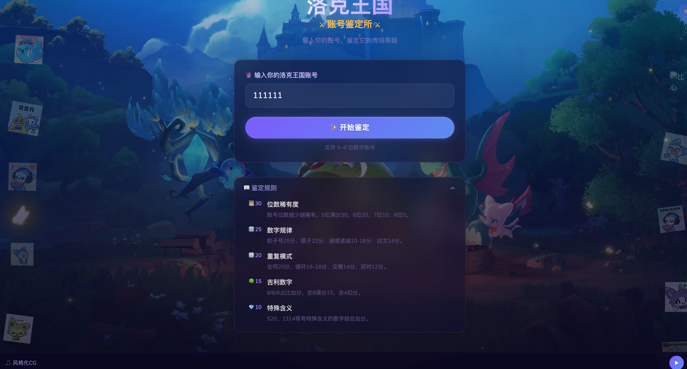
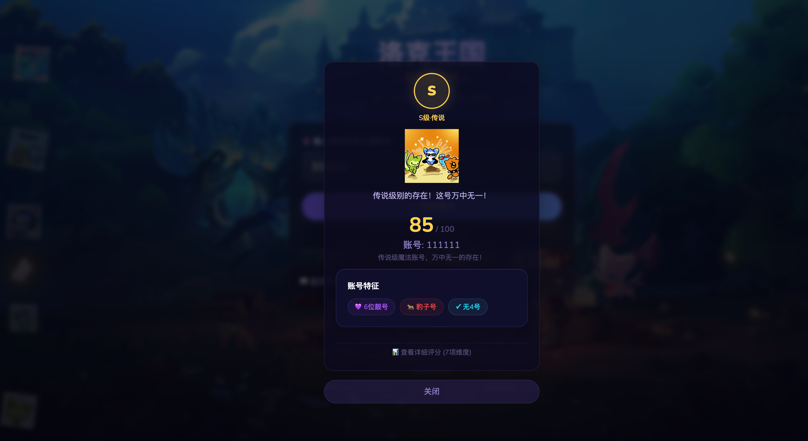

<p align="center">
  
</p>

<h1 align="center">🏰 洛克王国 · 账号鉴定所</h1>

<p align="center">
  <strong>输入你的洛克王国账号，鉴定它的传说等级！</strong>
</p>

<p align="center">
  
  
  
  
</p>

---

## ✨ 项目简介

**洛克王国账号鉴定所** 是一个趣味性的纯前端账号评分工具，灵感来自洛克王国游戏。用户输入 5\~11 位的纯数字账号，系统将从 **7 个维度** 进行全面鉴定，最终给出 **S/A/B/C/D** 五个等级评定，并自动生成个性化的账号特征标签。

> 🎮 每一个账号都有属于自己的故事，来看看你的账号值多少分吧！

---

## 📸 界面预览

### 🎯 主界面 — 输入账号 & 鉴定规则



### 🏆 评分结果 — 等级鉴定 & 账号特征



---

## 🎯 功能特色

- 🔢 **7 维度智能评分** — 位数稀有度、数字规律、重复模式、吉利数字、特殊含义、数字多样性、首尾印象
- 🏅 **5 档等级评定** — S 级传说 / A 级史诗 / B 级稀有 / C 级普通 / D 级见习
- 🏷️ **自动标签系统** — 豹子号、顺子号、回文号、吉利号、爱情号等 17 种特征标签
- 🎨 **沉浸式 UI** — 深色魔幻风格，萤火虫粒子动画，洛克王国表情包漂浮
- 🎵 **背景音乐** — 内置洛克王国经典 BGM，增强鉴定仪式感
- 🖼️ **双背景切换** — 支持三测海报 / 定档海报两种背景氛围
- 📱 **纯前端运行** — 无需后端，所有计算在浏览器本地完成

---

## 📊 评分体系详解

总分 **100 分**，由 7 个评分维度加权组成：

### 1️⃣ 位数稀有度（满分 20 分）

> 账号位数越少越稀有，位数是账号价值的基石。

| 位数 | 得分 | 说明 |
|:---:|:---:|:---|
| 5 位 | 20 | 极稀有账号，顶级收藏品！ |
| 6 位 | 18 | 稀有账号，非常珍贵！ |
| 7 位 | 15 | 稀有度很不错 |
| 8 位 | 12 | 较有价值 |
| 9 位 | 12 | 主流位数 |
| 10 位 | 10 | 常见位数 |
| 11 位 | 9 | 长位数账号 |

### 2️⃣ 数字规律（满分 20 分）

> 账号中蕴含的数字规律，体现账号的"灵性"。

| 规律类型 | 得分 | 示例 |
|:---|:---:|:---|
| 🐆 豹子号（全同数字） | **20** | `888888` |
| 📈 完全顺子 | **18** | `12345`、`98765` |
| 🔢 等差数列 | **16** | `13579` |
| 🔄 交替模式 | **15** | `121212` |
| 📐 部分顺子 | 10~16 | 含 3 位以上连续递增/递减 |
| 🪞 回文号 | 10~15 | `12321` |
| 🔚 尾部连号 | 6~12 | `12888` |
| 🔛 首部连号 | 6~12 | `88812` |

### 3️⃣ 重复模式（满分 15 分）

> 评估账号数字的重复结构之美。

| 模式类型 | 得分 | 示例 |
|:---|:---:|:---|
| 全同 AAAA... | **15** | `888888` |
| 循环 ABCABC | 10~14 | `123123` |
| 交替 ABAB | **13** | `282828` |
| 双对 AABB | **12** | `112233` |
| 对称回文 | **11** | `12321` |
| 含 4 连同 | **13** | `18888` |
| 含 3 连同 | **11** | `1888` |

### 4️⃣ 吉利数字（满分 15 分）

> 8、6、9 为吉利数字，4 会小幅减分。

| 情况 | 影响 |
|:---|:---|
| 全 8 账号 | 满分 **15 分** 💰 |
| 全 6 / 全 9 | **14 分** |
| 吉利数字占比高 | 按比例加分（最高 +6） |
| 含 `8888` / `888` / `88` | 额外加分 +2 / +1.5 / +0.5 |
| 含 `666` / `99` / `77` | 额外加分 |
| 每含一个 `4` | 减 0.5 分 |
| 无 `4` 账号（≥5 位） | 额外 +1 |

### 5️⃣ 特殊含义（满分 10 分）

> 识别数字背后的文化内涵和谐音含义。

| 数字组合 | 含义 | 得分 |
|:---|:---|:---:|
| `5201314` | 我爱你一生一世 | +8 |
| `520` / `521` | 我爱你 | +4 / +3 |
| `1314` | 一生一世 | +4 |
| `1688` / `168` / `518` | 一路发发 / 一路发 / 我要发 | +3 |
| `007` | 特工号 | +3 |
| `888` / `666` / `999` | 发发发 / 大顺 / 长久 | +2 |
| `1024` | 程序员日 | +2 |
| `9527` / `114514` | 经典梗 | +2 |
| 含年份 `1990~2026` | 年份号 | +3 |
| 整万号（如 `10000`） | 整数号 | +5~7 |

### 6️⃣ 数字多样性（满分 10 分）

> 数字种类的丰富与均衡程度。

| 不同数字种类 | 得分 | 说明 |
|:---:|:---:|:---|
| 1 种 | 7 | 单一数字，简约之美 |
| 2 种 | 8 | 简洁有力 |
| 3 种 | 9 | 丰富度不错 |
| 4~5 种 | **10** | 丰富均衡（最优） |
| 6 种 | 9 | 种类丰富 |
| ≥7 种 | 7~8 | 略显杂乱 |

### 7️⃣ 首尾印象（满分 10 分）

> 第一印象与收尾寓意。

- **首位数字**：8（+3）> 6/9（+2.5）> 1/7（+2）> 5/3/2（+1.5）> 0/4（+1）
- **尾位数字**：8（+3）> 6/9（+2.5）> 7（+2）> 1/5/3/2（+1.5）> 0/4（+1）
- **首尾相同**：额外 +1 分
- **首尾均为 8**：再加 +0.5 分

---

### 🌟 短号品质加成

5~7 位的稀有短号享受额外加成机制：

- 根据「数字规律 + 重复模式 + 吉利数字 + 特殊含义」四项品质综合评估
- **5 位号**加成系数 ×1.3，**6 位号**标准加成，**7 位号**×0.85
- 最高可获得 **+10 分** 额外加成

---

## 🏅 等级评定

| 等级 | 分数 | 称号 | 描述 |
|:---:|:---:|:---|:---|
| **S** | ≥82 | 🟡 S级·传说 | 传说级魔法账号，万中无一的存在！ |
| **A** | 65~81 | 🟣 A级·史诗 | 史诗级冒险者认证，值得珍藏！ |
| **B** | 50~64 | 🟢 B级·稀有 | 稀有冒险者，有亮点有实力 |
| **C** | 35~49 | 🔵 C级·普通 | 普通冒险者，中规中矩 |
| **D** | <35 | 🔘 D级·见习 | 见习冒险者，但也是独一无二的 |

---

## 🏷️ 标签系统

系统根据账号特征自动生成个性化标签：

| 标签 | 触发条件 |
|:---|:---|
| 👑 5位稀有号 | 位数 ≤5 |
| 💜 6位靓号 | 位数 = 6 |
| 🐆 豹子号 | 全部数字相同 |
| 📈 顺子号 | 完全递增或递减 |
| 🪞 回文号 | 正反读相同 |
| 💕 双双对号 | AABB 模式 |
| 🔄 交替号 | ABAB 模式 |
| 🍀 吉利号 | 8/6/9 占比 ≥60% |
| 💰 至尊发财号 | 全 8 |
| ✅ 无4号 | 不含数字 4 |
| ❤️ 爱情号 | 含 520 或 521 |
| 💍 一生一世 | 含 1314 |
| 6️⃣ 大顺号 | 含 666 |
| 📅 年份号 | 含 1990~2026 |
| 💯 整数号 | 能被 10000 整除 |
| 🎯 首尾发 | 首尾均为 8 |

---

## 🚀 快速开始

### 环境要求

- Node.js ≥ 18
- npm ≥ 9

### 安装与运行

```bash
# 克隆仓库
git clone https://github.com/luomouren611/roco-score.git
cd roco-score

# 安装依赖
npm install

# 启动开发服务器
npm run dev

# 构建生产版本
npm run build
```

### 项目结构

```
roce-account/
├── public/                  # 静态资源
│   ├── backgrounds/         # 背景图片
│   ├── music/               # 背景音乐
│   └── stickers/            # 表情包贴纸
├── src/
│   ├── components/          # UI 组件
│   │   ├── Header.tsx       # 页头标题
│   │   ├── InputSection.tsx # 账号输入区
│   │   ├── ScorePopup.tsx   # 评分弹窗
│   │   ├── ScoreGauge.tsx   # 分数仪表盘
│   │   ├── DimensionBars.tsx# 维度条形图
│   │   ├── TagDisplay.tsx   # 标签展示
│   │   ├── RulesSection.tsx # 规则说明
│   │   ├── MusicPlayer.tsx  # 音乐播放器
│   │   ├── BgSwitcher.tsx   # 背景切换
│   │   ├── FireflyEffect.tsx# 萤火虫特效
│   │   ├── FloatingStickers.tsx # 漂浮贴纸
│   │   └── Footer.tsx       # 页脚
│   ├── scoring/             # 评分算法
│   │   ├── index.ts         # 总评分逻辑 & 等级判定
│   │   ├── digitRarity.ts   # 位数稀有度
│   │   ├── numberPattern.ts # 数字规律
│   │   ├── repeatPattern.ts # 重复模式
│   │   ├── luckyNumber.ts   # 吉利数字
│   │   ├── specialMeaning.ts# 特殊含义
│   │   ├── digitDiversity.ts# 数字多样性
│   │   ├── headTail.ts      # 首尾印象
│   │   └── tagGenerator.ts  # 标签生成器
│   ├── types/               # TypeScript 类型定义
│   ├── utils/               # 工具函数
│   ├── App.tsx              # 主应用组件
│   └── main.tsx             # 入口文件
├── docs/screenshots/        # 项目截图
└── package.json
```

---

## 🛠️ 技术栈

| 技术 | 用途 |
|:---|:---|
| **React 18** | UI 框架 |
| **TypeScript** | 类型安全 |
| **Tailwind CSS** | 原子化样式 |
| **Vite** | 构建工具 |
| **Lucide React** | 图标库 |
| **React Icons** | 补充图标 |

---

## 📄 许可证

本项目仅供学习交流使用，洛克王国相关素材版权归腾讯游戏所有。

---

<p align="center">
  <strong>⭐ 如果觉得有趣，欢迎 Star 支持！</strong>
</p>
